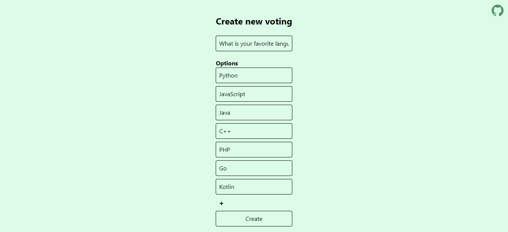

# ✋ Voting App
Create votings, share with your friends and see results.

[Visit App](https://vue-voting-app.netlify.app/)

## 📌 Screenshots

## 💻 Used Technologies
* Tailwind CSS
* JavaScript / Vue.js
* Firebase

## 📃 License
* Voting App licensed under the [MIT License](https://github.com/orhanemree/voting-app/blob/master/LICENSE). 